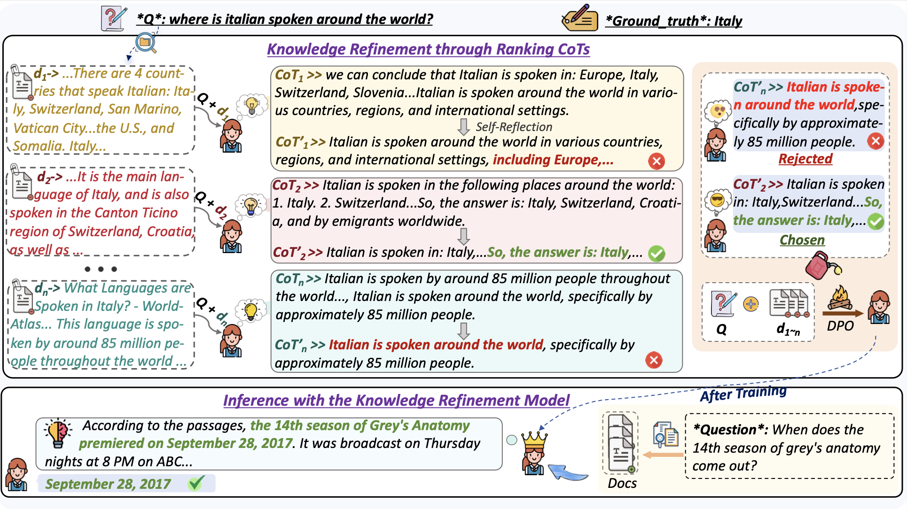

# RankCoT: Refining Knowledge for Retrieval-Augmented Generation through Ranking Chain-of-Thoughts

<!-- Source code for our paper :  
[RankCoT: Refining Knowledge for Retrieval-Augmented Generation through Ranking Chain-of-Thoughts](https://arxiv.org/ -->

Click the links below to view our papers, checkpoints:

<!-- <a href='https://arxiv.org'></a> -->
<a href='https://huggingface.co/MignonMiyoung/RankCoT'></a>

If you find this work useful, please cite our paper and give us a shining star 🌟
<!-- ```
@article{
}
``` -->

## Overview

RankCoT is a knowledge refinement method that incorporates reranking signals in generating CoT-based summarization for knowledge refinement based on given query and all retrieval documents. During training, RankCoT prompts the LLM to generate Chain-of-Thought (CoT) candidates based on the query and individual documents. It then fine-tunes the LLM to directly reproduce the best CoT from these candidate outputs based on all retrieved documents, which requires LLM to filter out irrelevant documents during generating CoT-style summarization. Additionally, RankCoT incorporates a self-reflection mechanism that further refines the CoT outputs, resulting in higher-quality training data.

## Set Up
**Use `git clone` to download this project**
```
git clone https://github.com/NEUIR/RankCoT.git
cd RankCoT
```
**To prevent conflicts between packages, we mainly use two virtual environment management packages, one for model inference and one for model training.**

```
for model inference, please:
conda env create -n llama3_inf -f inference_environment.yml

for model training, please:
conda env create -n llama3_ft -f training_environment.yml
```

## Using RankCoT model
**(1) Use `git clone` to download the model:**
❗️Note: This is a lora checkpoint of RankCoT, please merge it before use.
```
git clone https://huggingface.co/MignonMiyoung/RankCoT
```
**(2) Use `RankCoT model` to refine the knowledge:**
```
conda activate llama3_inf
python src/answer_generation/querypassage_to_CoT.py \
--model_path  # The path to RankCoT model \
--data_path # e.g. nq_modify10passage \
--output_name # e.g. nq_querypassage_to_CoT.jsonl
--max_psg_length 1500
```
**(3) Question answering:**
```
python src/answer_generation/queryCoT_to_answer.py \
--model_path  # e.g. Meta-Llama-3-8B-Instruct \
--data_path # e.g. nq_querypassage_to_CoT.jsonl \
--output_name # e.g. nq_queryCoT_to_answer.jsonl
```
For different tasks, you need to set different generation max tokens and different templates:
| TASK | max tokens| template| metrics|
|------|------|-----|-----|
| NQ | 32| QA_queryCoT_to_answer|accuracy |
| TriviaQA  | 32| QA_queryCoT_to_answer|accuracy |
|  HotpotQA | 32| QA_queryCoT_to_answer| accuracy|
|  PopQA | 32| QA_queryCoT_to_answer| accuracy|
|  ASQA | 200| QA_queryCoT_to_answer_forasqa| str-em|
| MARCO QA |100| QA_queryCoT_to_answer_forrouge| rouge |

**(4) Evaluating**
For different tasks, you need to use different metrics for evaluating.
We use different evaluation files to evaluate different tasks, and only one dataset is allowed at a time.
```
for accuracy metric, please:
python src/answer_generation/evaluate.py

for str-em metric, please:
python src/answer_generation/evaluate_forasqa.py

for rouge metric, please:
python src/answer_generation/evaluate_forrouge.py
```

## Training RankCoT
### Constructing training data
**(1) CoT data generation**
```
conda activate llama3_inf
python src/CoTdata_generation/querypassage_to_CoT.py \
--model_path  # Meta-Llama-3-8B-Instruct \
--data_path # e.g.  \
--output_name # e.g. _querypassage_to_CoT.jsonl
```

**(2) CoT refinement through self-reflection**
```
python src/answer_generation/queryCoT_to_answer.py \
--model_path  # e.g. Meta-Llama-3-8B-Instruct \
--data_path # e.g. querypassage_to_CoT.jsonl \
--output_name # e.g. queryCoT_to_answer.jsonl
```

**(3) Constructing preference data**
```
python src/modelft/COT_MODELANSWER_dpodata_gen.py
```

**(4) Filter invalid data**
```
python src/modelft/select_notnone_data.py
```

**(5) Data ratio division**
```
python src/modelft/dataset_partitioning_dataprocess.py
```

### Training the Model
**After constructing the training data, you can start training the RankCoT model.**

(1) First step: You need to download [Llama3-8B-Instruct](https://huggingface.co/meta-llama/Meta-Llama-3-8B-Instruct) model as  Knowledge Refinement Model.

(2) Second step: use lora to train the model
```
conda activate llama3_ft
cd scripts
bash scripts/lora_dpo_llama.sh
```

(3) Third step: Select the checkpoint with the lowest eval loss, and combine the weights of the RankCoT model trained using lora in Second step.
```
python src/modelft/merge_model.py
```


## Contact
If you have questions, suggestions, and bug reports, please email:
```
2401930@stu.neu.edu.cn 
```